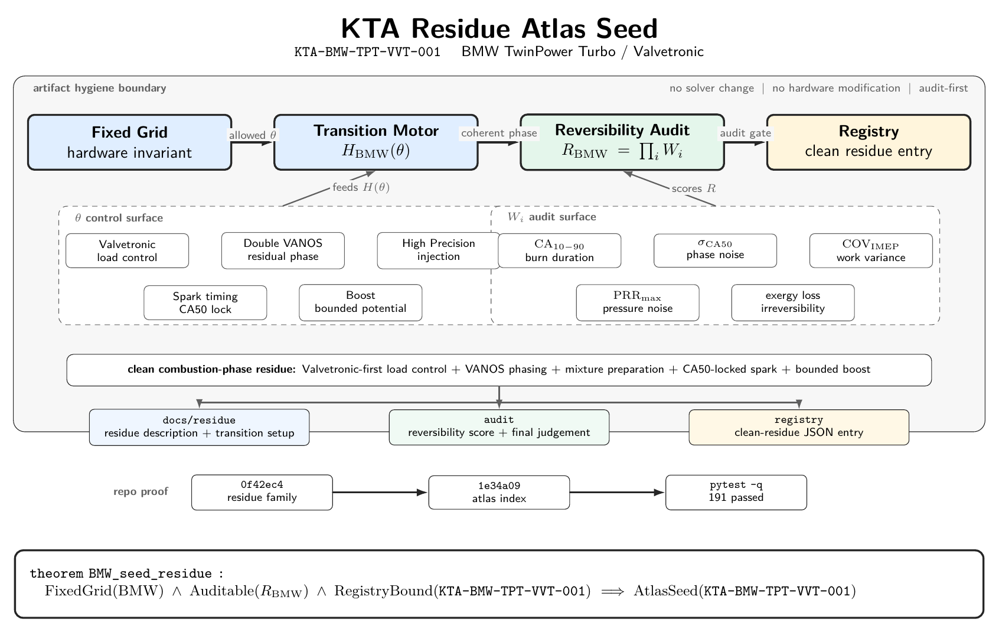

# KTA Residue Atlas

Deze map bevat vastgelegde KTA-residue artefacten: motor-, transitie- en auditbeschrijvingen die als blijvende Atlas-neerslag worden behandeld.

Een residue in deze map is geen solver-implementatie en geen hardware-wijzigingsvoorstel. Het is een geordende beschrijving van:

- de fysieke grid-invariant
- de toegestane transition knobs
- de auditbare reversibiliteitslogica
- de registry-status van de clean residue

## Residue families

### BMW TwinPower Turbo / Valvetronic
**Residue ID:** `KTA-BMW-TPT-VVT-001`  **Status:** `provisionally_clean`  **Class:** `combustion_phase_coherence`

#### Figure

Source: [`bmw_tpt_vvt_residue_seed.tex`](./assets/bmw_tpt_vvt_residue_seed.tex) · Render: [`bmw_tpt_vvt_residue_seed.pdf`](./assets/bmw_tpt_vvt_residue_seed.pdf)

This figure shows the fixed-grid transition flow for `KTA-BMW-TPT-VVT-001`: physical invariant, transition motor, reversibility audit, registry binding, control surface, audit surface, and repo proof.

Files:

- [BMW_TwinPowerTurbo_Valvetronic.KTA.md](./BMW_TwinPowerTurbo_Valvetronic.KTA.md)  
  Hoofdresidue voor het BMW TwinPower Turbo / Valvetronic grid.

- [transition_motor_setup.md](./transition_motor_setup.md)  
  Transition Motor configuratie voor de BMW actuatorruimte.

Gerelateerde audit- en registry-files:

- [../../audit/reversibility_score.yaml](../../audit/reversibility_score.yaml)  
  Auditbare reversibiliteitsscore voor de BMW residue-set.

- [../../audit/final_residue.md](../../audit/final_residue.md)  
  Korte final-residue beoordeling en atlas-seed status.

- [../../registry/BMW_TPT_clean_residue.json](../../registry/BMW_TPT_clean_residue.json)  
  Registry-entry voor de clean residue.

### Logistics Inventory / Supply Chain

**Residue ID:** `KTA-SUPPLY-INVENTORY-001`  **Status:** `candidate_clean`  **Class:** `information_coherence`

Files:

- [Supply_Inventory_Transition_Motor.KTA.md](./Supply_Inventory_Transition_Motor.KTA.md)  
  Hoofdresidue voor de logistics inventory transition motor.

- [supply_transition_motor_setup.md](./supply_transition_motor_setup.md)  
  Transition Motor configuratie voor voorraadbeheer en replenishment-governance.

Gerelateerde audit- en registry-files:

- [../../audit/supply_reversibility_score.yaml](../../audit/supply_reversibility_score.yaml)  
  Auditdefinitie voor reversibiliteit en voorraadcoherentie onder onzekerheid.

- [../../audit/supply_final_residue.md](../../audit/supply_final_residue.md)  
  Korte final-residue beoordeling voor de supply-chain seed.

- [../../registry/supply_inventory_clean_residue.json](../../registry/supply_inventory_clean_residue.json)  
  Registry-entry voor de supply inventory clean residue.

## Artifact policy

Residue-artefacten in deze map moeten aan de volgende regels voldoen:

1. **Geen fysieke modificaties** Hardware-geometrie, injectorpositie, klepmechaniek, turbo-layout en overige fixed-grid eigenschappen blijven invariant.

2. **Geen solvergedrag** Deze documenten mogen geen runtime-logica, optimalisatiesolver, testgedrag of simulatiepad wijzigen.

3. **Audit-first structuur** Elke residue moet verwijzen naar meetbare audit-signalen zoals fasecoherentie, variantie, drukruis, warmteresidu of reversibiliteit.

4. **Registry-koppeling verplicht** Elke blijvende residue moet een corresponderende entry hebben onder `registry/`.

5. **Residue boven tuning** De primaire output is geen vermogenswinst of kalibratieadvies, maar een robuuste, herleidbare KTA-neerslag.

## Huidige atlas-seeds

| Residue ID | Grid | Class | Status |
|---|---|---|---|
| `KTA-BMW-TPT-VVT-001` | BMW TwinPower Turbo / Valvetronic | `combustion_phase_coherence` | `provisionally_clean` |
| `KTA-SUPPLY-INVENTORY-001` | Logistics Inventory / Supply Chain | `information_coherence` | `candidate_clean` |
